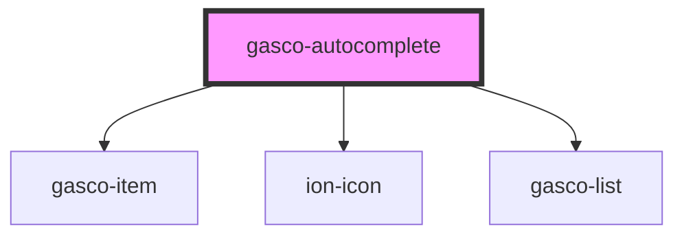

# gasco-autocomplete

<!-- Auto Generated Below -->

## Properties

| Property           | Attribute            | Description                                                                                                                                                                                                                                                                                                          | Type                                                                                                                                                                                                                                                                                                                                                                                                                                                                                                                                                                                                                                                                                                                                                                                                                                                                                                                        | Default     |
| ------------------ | -------------------- | -------------------------------------------------------------------------------------------------------------------------------------------------------------------------------------------------------------------------------------------------------------------------------------------------------------------- | --------------------------------------------------------------------------------------------------------------------------------------------------------------------------------------------------------------------------------------------------------------------------------------------------------------------------------------------------------------------------------------------------------------------------------------------------------------------------------------------------------------------------------------------------------------------------------------------------------------------------------------------------------------------------------------------------------------------------------------------------------------------------------------------------------------------------------------------------------------------------------------------------------------------------- | ----------- |
| `animated`         | `animated`           | If `true`, enable searchbar animation.                                                                                                                                                                                                                                                                               | `boolean`                                                                                                                                                                                                                                                                                                                                                                                                                                                                                                                                                                                                                                                                                                                                                                                                                                                                                                                   | `false`     |
| `autocomplete`     | `autocomplete`       | Set the input's autocomplete property.                                                                                                                                                                                                                                                                               | `"on" \| "off" \| "name" \| "honorific-prefix" \| "given-name" \| "additional-name" \| "family-name" \| "honorific-suffix" \| "nickname" \| "email" \| "username" \| "new-password" \| "current-password" \| "one-time-code" \| "organization-title" \| "organization" \| "street-address" \| "address-line1" \| "address-line2" \| "address-line3" \| "address-level4" \| "address-level3" \| "address-level2" \| "address-level1" \| "country" \| "country-name" \| "postal-code" \| "cc-name" \| "cc-given-name" \| "cc-additional-name" \| "cc-family-name" \| "cc-number" \| "cc-exp" \| "cc-exp-month" \| "cc-exp-year" \| "cc-csc" \| "cc-type" \| "transaction-currency" \| "transaction-amount" \| "language" \| "bday" \| "bday-day" \| "bday-month" \| "bday-year" \| "sex" \| "tel" \| "tel-country-code" \| "tel-national" \| "tel-area-code" \| "tel-local" \| "tel-extension" \| "impp" \| "url" \| "photo"` | `'off'`     |
| `autocorrect`      | `autocorrect`        | Set the input's autocorrect property.                                                                                                                                                                                                                                                                                | `"off" \| "on"`                                                                                                                                                                                                                                                                                                                                                                                                                                                                                                                                                                                                                                                                                                                                                                                                                                                                                                             | `'off'`     |
| `clearIcon`        | `clear-icon`         | Set the clear icon. Defaults to `close-circle` for `ios` and `close-sharp` for `md`.                                                                                                                                                                                                                                 | `string`                                                                                                                                                                                                                                                                                                                                                                                                                                                                                                                                                                                                                                                                                                                                                                                                                                                                                                                    | `undefined` |
| `color`            | `color`              | The color to use from your application's color palette. Default options are: `"primary"`, `"secondary"`, `"tertiary"`, `"success"`, `"warning"`, `"danger"`, `"light"`, `"medium"`, and `"dark"`.                                                                                                                    | `"danger" \| "dark" \| "light" \| "medium" \| "primary" \| "secondary" \| "success" \| "tertiary" \| "warning" \| string & Record<never, never>`                                                                                                                                                                                                                                                                                                                                                                                                                                                                                                                                                                                                                                                                                                                                                                            | `undefined` |
| `debounce`         | `debounce`           | Set the amount of time, in milliseconds, to wait to trigger the `gascoChange` event after each keystroke. This also impacts form bindings such as `ngModel` or `v-model`.                                                                                                                                            | `number`                                                                                                                                                                                                                                                                                                                                                                                                                                                                                                                                                                                                                                                                                                                                                                                                                                                                                                                    | `250`       |
| `disabled`         | `disabled`           | If `true`, the user cannot interact with the input.                                                                                                                                                                                                                                                                  | `boolean`                                                                                                                                                                                                                                                                                                                                                                                                                                                                                                                                                                                                                                                                                                                                                                                                                                                                                                                   | `false`     |
| `enterkeyhint`     | `enterkeyhint`       | A hint to the browser for which enter key to display. Possible values: `"enter"`, `"done"`, `"go"`, `"next"`, `"previous"`, `"search"`, and `"send"`.                                                                                                                                                                | `"done" \| "enter" \| "go" \| "next" \| "previous" \| "search" \| "send"`                                                                                                                                                                                                                                                                                                                                                                                                                                                                                                                                                                                                                                                                                                                                                                                                                                                   | `undefined` |
| `inputmode`        | `inputmode`          | A hint to the browser for which keyboard to display. Possible values: `"none"`, `"text"`, `"tel"`, `"url"`, `"email"`, `"numeric"`, `"decimal"`, and `"search"`.                                                                                                                                                     | `"decimal" \| "email" \| "none" \| "numeric" \| "search" \| "tel" \| "text" \| "url"`                                                                                                                                                                                                                                                                                                                                                                                                                                                                                                                                                                                                                                                                                                                                                                                                                                       | `undefined` |
| `placeholder`      | `placeholder`        | Set the input's placeholder. `placeholder` can accept either plaintext or HTML as a string. To display characters normally reserved for HTML, they must be escaped. For example `<Ionic>` would become `&lt;Ionic&gt;`  For more information: [Security Documentation](https://ionicframework.com/docs/faq/security) | `string`                                                                                                                                                                                                                                                                                                                                                                                                                                                                                                                                                                                                                                                                                                                                                                                                                                                                                                                    | `'Search'`  |
| `searchIcon`       | `search-icon`        | The icon to use as the search icon. Defaults to `search-outline` in `ios` mode and `search-sharp` in `md` mode.                                                                                                                                                                                                      | `string`                                                                                                                                                                                                                                                                                                                                                                                                                                                                                                                                                                                                                                                                                                                                                                                                                                                                                                                    | `undefined` |
| `showCancelButton` | `show-cancel-button` | Sets the behavior for the cancel button. Defaults to `"never"`. Setting to `"focus"` shows the cancel button on focus. Setting to `"never"` hides the cancel button. Setting to `"always"` shows the cancel button regardless of focus state.                                                                        | `"always" \| "focus" \| "never"`                                                                                                                                                                                                                                                                                                                                                                                                                                                                                                                                                                                                                                                                                                                                                                                                                                                                                            | `'never'`   |
| `showClearButton`  | `show-clear-button`  | Sets the behavior for the clear button. Defaults to `"focus"`. Setting to `"focus"` shows the clear button on focus if the input is not empty. Setting to `"never"` hides the clear button. Setting to `"always"` shows the clear button regardless of focus state, but only if the input is not empty.              | `"always" \| "focus" \| "never"`                                                                                                                                                                                                                                                                                                                                                                                                                                                                                                                                                                                                                                                                                                                                                                                                                                                                                            | `'always'`  |
| `spellcheck`       | `spellcheck`         | If `true`, enable spellcheck on the input.                                                                                                                                                                                                                                                                           | `boolean`                                                                                                                                                                                                                                                                                                                                                                                                                                                                                                                                                                                                                                                                                                                                                                                                                                                                                                                   | `false`     |
| `suggestionlist`   | --                   | Values that the auto-complete textbox should search for                                                                                                                                                                                                                                                              | `string[]`                                                                                                                                                                                                                                                                                                                                                                                                                                                                                                                                                                                                                                                                                                                                                                                                                                                                                                                  | `[]`        |
| `type`             | `type`               | Set the type of the input.                                                                                                                                                                                                                                                                                           | `string`                                                                                                                                                                                                                                                                                                                                                                                                                                                                                                                                                                                                                                                                                                                                                                                                                                                                                                                    | `'text'`    |
| `value`            | `value`              | the value of the searchbar.                                                                                                                                                                                                                                                                                          | `string`                                                                                                                                                                                                                                                                                                                                                                                                                                                                                                                                                                                                                                                                                                                                                                                                                                                                                                                    | `''`        |

## Events

| Event         | Description                                     | Type                                      |
| ------------- | ----------------------------------------------- | ----------------------------------------- |
| `gascoBlur`   | Emitted when the input loses focus.             | `CustomEvent<void>`                       |
| `gascoCancel` | Emitted when the cancel button is clicked.      | `CustomEvent<void>`                       |
| `gascoChange` | Emitted when the value has changed.             | `CustomEvent<SearchbarChangeEventDetail>` |
| `gascoClear`  | Emitted when the clear input button is clicked. | `CustomEvent<void>`                       |
| `gascoFocus`  | Emitted when the input has focus.               | `CustomEvent<void>`                       |
| `gascoInput`  | Emitted when a keyboard input occurred.         | `CustomEvent<KeyboardEvent>`              |

## Methods

### `getInputElement() => Promise<HTMLInputElement>`

Returns the native `<input>` element used under the hood.

#### Returns

Type: `Promise<HTMLInputElement>`

### `setFocus() => Promise<void>`

Sets focus on the specified `gasco-autocomplete`. Use this method instead of the global
`input.focus()`.

#### Returns

Type: `Promise<void>`

## CSS Custom Properties

| Name                        | Description                              |
| --------------------------- | ---------------------------------------- |
| `--background`              | Background of the searchbar input        |
| `--border-radius`           | Border radius of the searchbar input     |
| `--box-shadow`              | Box shadow of the searchbar input        |
| `--cancel-button-color`     | Color of the searchbar cancel button     |
| `--clear-button-color`      | Color of the searchbar clear button      |
| `--color`                   | Color of the searchbar text              |
| `--icon-color`              | Color of the searchbar icon              |
| `--placeholder-color`       | Color of the searchbar placeholder       |
| `--placeholder-font-style`  | Font style of the searchbar placeholder  |
| `--placeholder-font-weight` | Font weight of the searchbar placeholder |
| `--placeholder-opacity`     | Opacity of the searchbar placeholder     |

## Dependencies

### Depends on

- [gasco-item](../gasco-item)
- ion-icon
- [gasco-list](../gasco-list)

### Graph

----------------------------------------------

*Built with [StencilJS](https://stenciljs.com/)*
