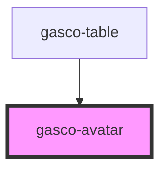

# gasco-avatar

<!-- Auto Generated Below -->

## Properties

| Property           | Attribute | Description | Type     | Default     |
| ------------------ | --------- | ----------- | -------- | ----------- |
| `alt` _(required)_ | `alt`     |             | `string` | `undefined` |
| `src` _(required)_ | `src`     |             | `string` | `undefined` |

## Shadow Parts

| Part       | Description |
| ---------- | ----------- |
| `"native"` |             |

## Dependencies

### Used by

 - [gasco-table](../gasco-table)

### Graph

----------------------------------------------

*Built with [StencilJS](https://stenciljs.com/)*
