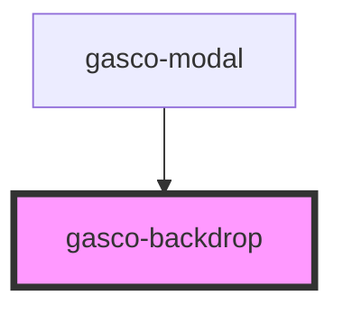

# gasco-backdrop

<!-- Auto Generated Below -->

## Properties

| Property          | Attribute          | Description                                                                             | Type      | Default |
| ----------------- | ------------------ | --------------------------------------------------------------------------------------- | --------- | ------- |
| `stopPropagation` | `stop-propagation` | If `true`, the backdrop will stop propagation on tap.                                   | `boolean` | `true`  |
| `tappable`        | `tappable`         | If `true`, the backdrop will can be clicked and will emit the `gascoBackdropTap` event. | `boolean` | `true`  |
| `visible`         | `visible`          | If `true`, the backdrop will be visible.                                                | `boolean` | `true`  |

## Events

| Event              | Description                          | Type                |
| ------------------ | ------------------------------------ | ------------------- |
| `gascoBackdropTap` | Emitted when the backdrop is tapped. | `CustomEvent<void>` |

## Dependencies

### Used by

 - [gasco-modal](../gasco-modal)

### Graph

----------------------------------------------

*Built with [StencilJS](https://stenciljs.com/)*
