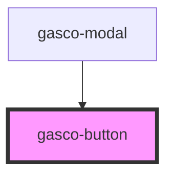

# gasco-button

<!-- Auto Generated Below -->

## Properties

| Property     | Attribute     | Description                                                                                                                                                                                                   | Type                                                                                                                                             | Default     |
| ------------ | ------------- | ------------------------------------------------------------------------------------------------------------------------------------------------------------------------------------------------------------- | ------------------------------------------------------------------------------------------------------------------------------------------------ | ----------- |
| `buttonType` | `button-type` | The type of button.                                                                                                                                                                                           | `string`                                                                                                                                         | `'button'`  |
| `color`      | `color`       | The color to use from your application's color palette. Default options are: `"primary"`, `"secondary"`, `"success"`, `"warning"` and `"danger"`.                                                             | `"danger" \| "dark" \| "light" \| "medium" \| "primary" \| "secondary" \| "success" \| "tertiary" \| "warning" \| string & Record<never, never>` | `'primary'` |
| `disabled`   | `disabled`    | If `true`, the user cannot interact with the button.                                                                                                                                                          | `boolean`                                                                                                                                        | `false`     |
| `fill`       | `fill`        | Set to `"clear"` for a transparent button, to `"outline"` for a transparent button with a border, or to `"solid"`. The default style is `"solid"` except inside of a toolbar, where the default is `"clear"`. | `"clear" \| "default" \| "outline" \| "solid"`                                                                                                   | `undefined` |
| `progress`   | `progress`    | If `true`, the user cannot interact with the button in progress.                                                                                                                                              | `boolean`                                                                                                                                        | `false`     |
| `shape`      | `shape`       | The button shape.                                                                                                                                                                                             | `"round"`                                                                                                                                        | `undefined` |
| `size`       | `size`        | The button size.                                                                                                                                                                                              | `"default" \| "large" \| "small"`                                                                                                                | `undefined` |
| `strong`     | `strong`      | If `true`, activates a button with a heavier font weight.                                                                                                                                                     | `boolean`                                                                                                                                        | `false`     |
| `type`       | `type`        | The type of the button.                                                                                                                                                                                       | `"button" \| "reset" \| "submit"`                                                                                                                | `'button'`  |

## Events

| Event        | Description                          | Type                |
| ------------ | ------------------------------------ | ------------------- |
| `gascoBlur`  | Emitted when the button loses focus. | `CustomEvent<void>` |
| `gascoFocus` | Emitted when the button has focus.   | `CustomEvent<void>` |

## Slots

| Slot          | Description                                                                       |
| ------------- | --------------------------------------------------------------------------------- |
|               | Content is placed between the named slots if provided without a slot.             |
| `"end"`       | Content is placed to the right of the button text in LTR, and to the left in RTL. |
| `"icon-only"` | Should be used on an icon in a button that has no text.                           |
| `"start"`     | Content is placed to the left of the button text in LTR, and to the right in RTL. |

## Shadow Parts

| Part       | Description                                                             |
| ---------- | ----------------------------------------------------------------------- |
| `"native"` | The native HTML button or anchor element that wraps all child elements. |

## CSS Custom Properties

| Name                             | Description                                                                                               |
| -------------------------------- | --------------------------------------------------------------------------------------------------------- |
| `--background`                   | Background of the button                                                                                  |
| `--background-activated`         | Background of the button when pressed. Note: setting this will interfere with the Material Design ripple. |
| `--background-activated-opacity` | Opacity of the button when pressed                                                                        |
| `--background-focused`           | Background of the button when focused with the tab key                                                    |
| `--background-focused-opacity`   | Opacity of the button when focused with the tab key                                                       |
| `--background-hover`             | Background of the button on hover                                                                         |
| `--background-hover-opacity`     | Opacity of the background on hover                                                                        |
| `--border-color`                 | Border color of the button                                                                                |
| `--border-radius`                | Border radius of the button                                                                               |
| `--border-style`                 | Border style of the button                                                                                |
| `--border-width`                 | Border width of the button                                                                                |
| `--box-shadow`                   | Box shadow of the button                                                                                  |
| `--color`                        | Text color of the button                                                                                  |
| `--color-activated`              | Text color of the button when pressed                                                                     |
| `--color-focused`                | Text color of the button when focused with the tab key                                                    |
| `--color-hover`                  | Text color of the button when hover                                                                       |
| `--opacity`                      | Opacity of the button                                                                                     |
| `--padding-bottom`               | Bottom padding of the button                                                                              |
| `--padding-end`                  | Right padding if direction is left-to-right, and left padding if direction is right-to-left of the button |
| `--padding-start`                | Left padding if direction is left-to-right, and right padding if direction is right-to-left of the button |
| `--padding-top`                  | Top padding of the button                                                                                 |
| `--ripple-color`                 | Color of the button ripple effect                                                                         |
| `--transition`                   | Transition of the button                                                                                  |

## Dependencies

### Used by

 - [gasco-modal](../gasco-modal)

### Graph

----------------------------------------------

*Built with [StencilJS](https://stenciljs.com/)*
