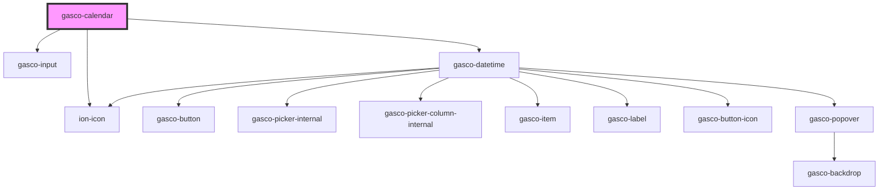

# gasco-calendar

<!-- Auto Generated Below -->

## Properties

| Property          | Attribute           | Description | Type      | Default |
| ----------------- | ------------------- | ----------- | --------- | ------- |
| `fireFocusEvents` | `fire-focus-events` |             | `boolean` | `true`  |

## Events

| Event              | Description                         | Type                                  |
| ------------------ | ----------------------------------- | ------------------------------------- |
| `gascoBlur`        | Emitted when the input loses focus. | `CustomEvent<FocusEvent>`             |
| `gascoChangeValue` | Emitted when the value has changed. | `CustomEvent<InputChangeEventDetail>` |
| `gascoFocus`       | Emitted when the input has focus.   | `CustomEvent<FocusEvent>`             |

## Shadow Parts

| Part       | Description |
| ---------- | ----------- |
| `"native"` |             |

## Dependencies

### Depends on

- [gasco-input](../gasco-input)
- ion-icon
- [gasco-datetime](../gasco-datetime)

### Graph

----------------------------------------------

*Built with [StencilJS](https://stenciljs.com/)*
