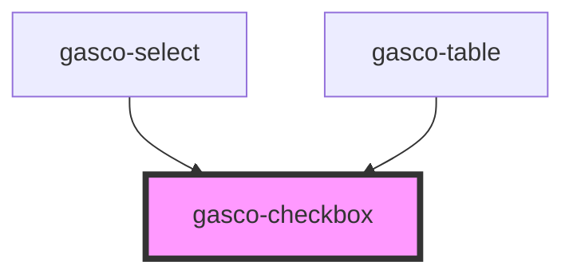

# gasco-checkbox

<!-- Auto Generated Below -->

## Properties

| Property        | Attribute       | Description                                                                                                                                                                                                                                                  | Type                                                                                                                                             | Default        |
| --------------- | --------------- | ------------------------------------------------------------------------------------------------------------------------------------------------------------------------------------------------------------------------------------------------------------ | ------------------------------------------------------------------------------------------------------------------------------------------------ | -------------- |
| `checked`       | `checked`       | If `true`, the checkbox is selected.                                                                                                                                                                                                                         | `boolean`                                                                                                                                        | `false`        |
| `color`         | `color`         |                                                                                                                                                                                                                                                              | `"danger" \| "dark" \| "light" \| "medium" \| "primary" \| "secondary" \| "success" \| "tertiary" \| "warning" \| string & Record<never, never>` | `'primary'`    |
| `disabled`      | `disabled`      | If `true`, the user cannot interact with the checkbox.                                                                                                                                                                                                       | `boolean`                                                                                                                                        | `false`        |
| `indeterminate` | `indeterminate` | If `true`, the checkbox will visually appear as indeterminate.                                                                                                                                                                                               | `boolean`                                                                                                                                        | `false`        |
| `name`          | `name`          | The name of the control, which is submitted with the form data.                                                                                                                                                                                              | `string`                                                                                                                                         | `this.inputId` |
| `value`         | `value`         | The value of the checkbox does not mean if it's checked or not, use the `checked` property for that.  The value of a checkbox is analogous to the value of an `<input type="checkbox">`, it's only used when the checkbox participates in a native `<form>`. | `any`                                                                                                                                            | `'on'`         |

## Events

| Event         | Description                                    | Type                                          |
| ------------- | ---------------------------------------------- | --------------------------------------------- |
| `gascoBlur`   | Emitted when the checkbox loses focus.         | `CustomEvent<void>`                           |
| `gascoChange` | Emitted when the checked property has changed. | `CustomEvent<CheckboxChangeEventDetail<any>>` |
| `gascoFocus`  | Emitted when the checkbox has focus.           | `CustomEvent<void>`                           |

## Shadow Parts

| Part          | Description                                       |
| ------------- | ------------------------------------------------- |
| `"container"` | The container for the checkbox mark.              |
| `"mark"`      | The checkmark used to indicate the checked state. |

## CSS Custom Properties

| Name                     | Description                                    |
| ------------------------ | ---------------------------------------------- |
| `--background`           | Background of the checkbox icon                |
| `--background-checked`   | Background of the checkbox icon when checked   |
| `--border-color`         | Border color of the checkbox icon              |
| `--border-color-checked` | Border color of the checkbox icon when checked |
| `--border-radius`        | Border radius of the checkbox icon             |
| `--border-style`         | Border style of the checkbox icon              |
| `--border-width`         | Border width of the checkbox icon              |
| `--checkmark-color`      | Color of the checkbox checkmark when checked   |
| `--checkmark-width`      | Stroke width of the checkbox checkmark         |
| `--size`                 | Size of the checkbox icon                      |
| `--transition`           | Transition of the checkbox icon                |

## Dependencies

### Used by

 - [gasco-select](../gasco-select)
 - [gasco-table](../gasco-table)

### Graph

----------------------------------------------

*Built with [StencilJS](https://stenciljs.com/)*
