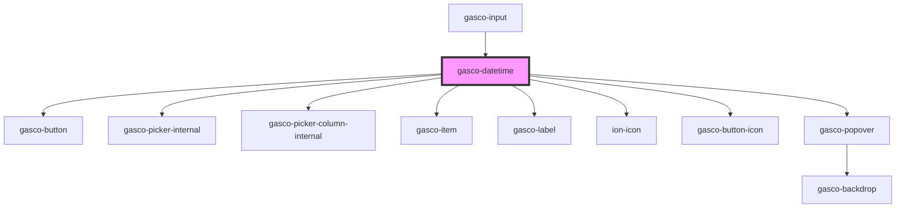

# gasco-datetime

<!-- Auto Generated Below -->

## Properties

| Property               | Attribute                 | Description                                                                                                                                                                                                                                                                                                                                                                                                                                                                                                                             | Type                                                                                                                                             | Default        |
| ---------------------- | ------------------------- | --------------------------------------------------------------------------------------------------------------------------------------------------------------------------------------------------------------------------------------------------------------------------------------------------------------------------------------------------------------------------------------------------------------------------------------------------------------------------------------------------------------------------------------- | ------------------------------------------------------------------------------------------------------------------------------------------------ | -------------- |
| `cancelText`           | `cancel-text`             | The text to display on the picker's cancel button.                                                                                                                                                                                                                                                                                                                                                                                                                                                                                      | `string`                                                                                                                                         | `'Cancel'`     |
| `clearText`            | `clear-text`              | The text to display on the picker's "Clear" button.                                                                                                                                                                                                                                                                                                                                                                                                                                                                                     | `string`                                                                                                                                         | `'Clear'`      |
| `color`                | `color`                   | The color to use from your application's color palette. Default options are: `"primary"`, `"secondary"`, `"success"`, `"warning"`, `"danger"`.                                                                                                                                                                                                                                                                                                                                                                                          | `"danger" \| "dark" \| "light" \| "medium" \| "primary" \| "secondary" \| "success" \| "tertiary" \| "warning" \| string & Record<never, never>` | `'primary'`    |
| `dayValues`            | `day-values`              | Values used to create the list of selectable days. By default every day is shown for the given month. However, to control exactly which days of the month to display, the `dayValues` input can take a number, an array of numbers, or a string of comma separated numbers. Note that even if the array days have an invalid number for the selected month, like `31` in February, it will correctly not show days which are not valid for the selected month.                                                                          | `number \| number[] \| string`                                                                                                                   | `undefined`    |
| `disabled`             | `disabled`                | If `true`, the user cannot interact with the datetime.                                                                                                                                                                                                                                                                                                                                                                                                                                                                                  | `boolean`                                                                                                                                        | `false`        |
| `doneText`             | `done-text`               | The text to display on the picker's "Done" button.                                                                                                                                                                                                                                                                                                                                                                                                                                                                                      | `string`                                                                                                                                         | `'Done'`       |
| `firstDayOfWeek`       | `first-day-of-week`       | The first day of the week to use for `gasco-datetime`. The default value is `0` and represents Sunday.                                                                                                                                                                                                                                                                                                                                                                                                                                  | `number`                                                                                                                                         | `0`            |
| `hourCycle`            | `hour-cycle`              | The hour cycle of the `gasco-datetime`. If no value is set, this is specified by the current locale.                                                                                                                                                                                                                                                                                                                                                                                                                                    | `"h12" \| "h23"`                                                                                                                                 | `undefined`    |
| `hourValues`           | `hour-values`             | Values used to create the list of selectable hours. By default the hour values range from `0` to `23` for 24-hour, or `1` to `12` for 12-hour. However, to control exactly which hours to display, the `hourValues` input can take a number, an array of numbers, or a string of comma separated numbers.                                                                                                                                                                                                                               | `number \| number[] \| string`                                                                                                                   | `undefined`    |
| `isDateEnabled`        | --                        | Returns if an individual date (calendar day) is enabled or disabled.  If `true`, the day will be enabled/interactive. If `false`, the day will be disabled/non-interactive.  The function accepts an ISO 8601 date string of a given day. By default, all days are enabled. Developers can use this function to write custom logic to disable certain days.  The function is called for each rendered calendar day, for the previous, current and next month. Custom implementations should be optimized for performance to avoid jank. | `(dateIsoString: string) => boolean`                                                                                                             | `undefined`    |
| `locale`               | `locale`                  | The locale to use for `gasco-datetime`. This impacts month and day name formatting. The `'default'` value refers to the default locale set by your device.                                                                                                                                                                                                                                                                                                                                                                              | `string`                                                                                                                                         | `'default'`    |
| `max`                  | `max`                     | The maximum datetime allowed. Value must be a date string following the [ISO 8601 datetime format standard](https://www.w3.org/TR/NOTE-datetime), `1996-12-19`. The format does not have to be specific to an exact datetime. For example, the maximum could just be the year, such as `1994`. Defaults to the end of this year.                                                                                                                                                                                                        | `string`                                                                                                                                         | `undefined`    |
| `min`                  | `min`                     | The minimum datetime allowed. Value must be a date string following the [ISO 8601 datetime format standard](https://www.w3.org/TR/NOTE-datetime), such as `1996-12-19`. The format does not have to be specific to an exact datetime. For example, the minimum could just be the year, such as `1994`. Defaults to the beginning of the year, 100 years ago from today.                                                                                                                                                                 | `string`                                                                                                                                         | `undefined`    |
| `minuteValues`         | `minute-values`           | Values used to create the list of selectable minutes. By default the minutes range from `0` to `59`. However, to control exactly which minutes to display, the `minuteValues` input can take a number, an array of numbers, or a string of comma separated numbers. For example, if the minute selections should only be every 15 minutes, then this input value would be `minuteValues="0,15,30,45"`.                                                                                                                                  | `number \| number[] \| string`                                                                                                                   | `undefined`    |
| `mode`                 | `mode`                    | The mode determines which platform styles to use.                                                                                                                                                                                                                                                                                                                                                                                                                                                                                       | `"ios" \| "md"`                                                                                                                                  | `undefined`    |
| `monthValues`          | `month-values`            | Values used to create the list of selectable months. By default the month values range from `1` to `12`. However, to control exactly which months to display, the `monthValues` input can take a number, an array of numbers, or a string of comma separated numbers. For example, if only summer months should be shown, then this input value would be `monthValues="6,7,8"`. Note that month numbers do *not* have a zero-based index, meaning January's value is `1`, and December's is `12`.                                       | `number \| number[] \| string`                                                                                                                   | `undefined`    |
| `name`                 | `name`                    | The name of the control, which is submitted with the form data.                                                                                                                                                                                                                                                                                                                                                                                                                                                                         | `string`                                                                                                                                         | `this.inputId` |
| `presentation`         | `presentation`            | Which values you want to select. `'date'` will show a calendar picker to select the month, day, and year. `'time'` will show a time picker to select the hour, minute, and (optionally) AM/PM. `'date-time'` will show the date picker first and time picker second. `'time-date'` will show the time picker first and date picker second.                                                                                                                                                                                              | `"date" \| "date-time" \| "month" \| "month-year" \| "time" \| "time-date" \| "year"`                                                            | `'date-time'`  |
| `readonly`             | `readonly`                | If `true`, the datetime appears normal but is not interactive.                                                                                                                                                                                                                                                                                                                                                                                                                                                                          | `boolean`                                                                                                                                        | `false`        |
| `showClearButton`      | `show-clear-button`       | If `true`, a "Clear" button will be rendered alongside the default "Cancel" and "OK" buttons at the bottom of the `gasco-datetime` component. Developers can also use the `button` slot if they want to customize these buttons. If custom buttons are set in the `button` slot then the default buttons will not be rendered.                                                                                                                                                                                                          | `boolean`                                                                                                                                        | `false`        |
| `showDefaultButtons`   | `show-default-buttons`    | If `true`, the default "Cancel" and "OK" buttons will be rendered at the bottom of the `gasco-datetime` component. Developers can also use the `button` slot if they want to customize these buttons. If custom buttons are set in the `button` slot then the default buttons will not be rendered.                                                                                                                                                                                                                                     | `boolean`                                                                                                                                        | `false`        |
| `showDefaultTimeLabel` | `show-default-time-label` | If `true`, the default "Time" label will be rendered for the time selector of the `gasco-datetime` component. Developers can also use the `time-label` slot if they want to customize this label. If a custom label is set in the `time-label` slot then the default label will not be rendered.                                                                                                                                                                                                                                        | `boolean`                                                                                                                                        | `true`         |
| `showDefaultTitle`     | `show-default-title`      | If `true`, a header will be shown above the calendar picker. On `ios` mode this will include the slotted title, and on `md` mode this will include the slotted title and the selected date.                                                                                                                                                                                                                                                                                                                                             | `boolean`                                                                                                                                        | `false`        |
| `size`                 | `size`                    | If `cover`, the `gasco-datetime` will expand to cover the full width of its container. If `fixed`, the `gasco-datetime` will have a fixed width.                                                                                                                                                                                                                                                                                                                                                                                        | `"cover" \| "fixed"`                                                                                                                             | `'fixed'`      |
| `value`                | `value`                   | The value of the datetime as a valid ISO 8601 datetime string.                                                                                                                                                                                                                                                                                                                                                                                                                                                                          | `string`                                                                                                                                         | `undefined`    |
| `yearValues`           | `year-values`             | Values used to create the list of selectable years. By default the year values range between the `min` and `max` datetime inputs. However, to control exactly which years to display, the `yearValues` input can take a number, an array of numbers, or string of comma separated numbers. For example, to show upcoming and recent leap years, then this input's value would be `yearValues="2024,2020,2016,2012,2008"`.                                                                                                               | `number \| number[] \| string`                                                                                                                   | `undefined`    |

## Events

| Event                | Description                                         | Type                                     |
| -------------------- | --------------------------------------------------- | ---------------------------------------- |
| `gascoBlur`          | Emitted when the datetime loses focus.              | `CustomEvent<void>`                      |
| `gascoBlurDatetime`  |                                                     | `CustomEvent<any>`                       |
| `gascoCancel`        | Emitted when the datetime selection was cancelled.  | `CustomEvent<void>`                      |
| `gascoChange`        | Emitted when the value (selected date) has changed. | `CustomEvent<DatetimeChangeEventDetail>` |
| `gascoDatetimeReady` | Emitted when the datetime loses focus.              | `CustomEvent<DatetimeParts>`             |
| `gascoFocus`         | Emitted when the datetime has focus.                | `CustomEvent<void>`                      |

## Methods

### `cancel(closeOverlay?: boolean) => Promise<void>`

Emits the gascoCancel event and
optionally closes the popover
or modal that the datetime was
presented in.

#### Returns

Type: `Promise<void>`

### `confirm(closeOverlay?: boolean) => Promise<void>`

Confirms the selected datetime value, updates the
`value` property, and optionally closes the popover
or modal that the datetime was presented in.

#### Returns

Type: `Promise<void>`

### `reset(startDate?: string) => Promise<void>`

Resets the internal state of the datetime but does not update the value.
Passing a valid ISO-8601 string will reset the state of the component to the provided date.
If no value is provided, the internal state will be reset to the clamped value of the min, max and today.

#### Returns

Type: `Promise<void>`

## Slots

| Slot           | Description                                      |
| -------------- | ------------------------------------------------ |
| `"buttons"`    | The buttons in the datetime.                     |
| `"time-label"` | The label for the time selector in the datetime. |
| `"title"`      | The title of the datetime.                       |

## CSS Custom Properties

| Name               | Description                                                     |
| ------------------ | --------------------------------------------------------------- |
| `--background`     | The primary background of the datetime component.               |
| `--background-rgb` | The primary background of the datetime component in RGB format. |
| `--title-color`    | The text color of the title.                                    |

## Dependencies

### Used by

 - [gasco-input](../gasco-input)

### Depends on

- [gasco-button](../gasco-button)
- [gasco-picker-internal](../gasco-picker-internal)
- [gasco-picker-column-internal](../gasco-picker-column-internal)
- [gasco-item](../gasco-item)
- [gasco-label](../gasco-label)
- ion-icon
- [gasco-button-icon](../gasco-button-icon)
- [gasco-popover](../gasco-popover)

### Graph

----------------------------------------------

*Built with [StencilJS](https://stenciljs.com/)*
