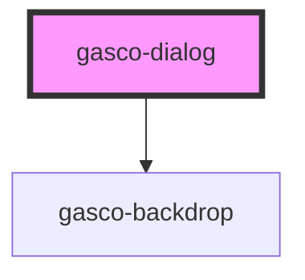

# gasco-dialog

<!-- Auto Generated Below -->

## Properties

| Property             | Attribute             | Description                                                                                                                                                                                                                                                                                                                                                                                          | Type                                     | Default     |
| -------------------- | --------------------- | ---------------------------------------------------------------------------------------------------------------------------------------------------------------------------------------------------------------------------------------------------------------------------------------------------------------------------------------------------------------------------------------------------- | ---------------------------------------- | ----------- |
| `animated`           | `animated`            | If `true`, the dialog will animate.                                                                                                                                                                                                                                                                                                                                                                  | `boolean`                                | `true`      |
| `backdropBreakpoint` | `backdrop-breakpoint` | A decimal value between 0 and 1 that indicates the point after which the backdrop will begin to fade in when using a sheet modal. Prior to this point, the backdrop will be hidden and the content underneath the sheet can be interacted with. This value is exclusive meaning the backdrop will become active after the value specified.                                                           | `number`                                 | `0`         |
| `backdropDismiss`    | `backdrop-dismiss`    | If `true`, the dialog will be dismissed when the backdrop is clicked.                                                                                                                                                                                                                                                                                                                                | `boolean`                                | `true`      |
| `breakpoints`        | --                    | The breakpoints to use when creating a sheet modal. Each value in the array must be a decimal between 0 and 1 where 0 indicates the modal is fully closed and 1 indicates the modal is fully open. Values are relative to the height of the modal, not the height of the screen. One of the values in this array must be the value of the `initialBreakpoint` property. For example: [0, .25, .5, 1] | `number[]`                               | `undefined` |
| `canDismiss`         | `can-dismiss`         | Determines whether or not a dialog can dismiss when calling the `dismiss` method.  If the value is `true` or the value's function returns `true`, the dialog will close when trying to dismiss. If the value is `false` or the value's function returns `false`, the dialog will not close when trying to dismiss.                                                                                   | `(() => Promise<boolean>) \| boolean`    | `undefined` |
| `enterAnimation`     | --                    | Animation to use when the modal is presented.                                                                                                                                                                                                                                                                                                                                                        | `(baseEl: any, opts?: any) => Animation` | `undefined` |
| `handle`             | `handle`              | The horizontal line that displays at the top of a sheet modal. It is `true` by default when setting the `breakpoints` and `initialBreakpoint` properties.                                                                                                                                                                                                                                            | `boolean`                                | `undefined` |
| `htmlAttributes`     | --                    | Additional attributes to pass to the dialog.                                                                                                                                                                                                                                                                                                                                                         | `{ [key: string]: any; }`                | `undefined` |
| `initialBreakpoint`  | `initial-breakpoint`  | A decimal value between 0 and 1 that indicates the initial point the modal will open at when creating a sheet modal. This value must also be listed in the `breakpoints` array.                                                                                                                                                                                                                      | `number`                                 | `undefined` |
| `isOpen`             | `is-open`             | If `true`, the dialog will open. If `false`, the dialog will close. Use this if you need finer grained control over presentation, otherwise just use the modalController or the `trigger` property. Note: `isOpen` will not automatically be set back to `false` when the dialog dismisses. You will need to do that in your code.                                                                   | `boolean`                                | `false`     |
| `keyboardClose`      | `keyboard-close`      | If `true`, the keyboard will be automatically dismissed when the overlay is presented.                                                                                                                                                                                                                                                                                                               | `boolean`                                | `true`      |
| `leaveAnimation`     | --                    | Animation to use when the modal is dismissed.                                                                                                                                                                                                                                                                                                                                                        | `(baseEl: any, opts?: any) => Animation` | `undefined` |
| `presentingElement`  | --                    | The element that presented the dialog. This is used for card presentation effects and for stacking multiple modals on top of each other. Only applies in iOS mode.                                                                                                                                                                                                                                   | `HTMLElement`                            | `undefined` |
| `showBackdrop`       | `show-backdrop`       | If `true`, a backdrop will be displayed behind the dialog. This property controls whether or not the backdrop darkens the screen when the dialog is presented. It does not control whether or not the backdrop is active or present in the DOM.                                                                                                                                                      | `boolean`                                | `true`      |
| `size`               | `size`                | The Modal size.                                                                                                                                                                                                                                                                                                                                                                                      | `"default" \| "large" \| "small"`        | `undefined` |
| `swipeToClose`       | `swipe-to-close`      | **[DEPRECATED]** - To prevent modals from dismissing, use canDismiss instead.  If `true`, the dialog can be swiped to dismiss. Only applies in iOS mode.                                                                                                                                                                                                      | `boolean`                                | `false`     |
| `trigger`            | `trigger`             | An ID corresponding to the trigger element that causes the dialog to open when clicked.                                                                                                                                                                                                                                                                                                              | `string`                                 | `undefined` |
| `type`               | `type`                | If `"default"`, the dialog will default. For default `"default"`.                                                                                                                                                                                                                                                                                                                                    | `string`                                 | `'default'` |
| `withclose`          | `withclose`           | If `true`, the dialog will button close.                                                                                                                                                                                                                                                                                                                                                             | `boolean`                                | `false`     |

## Events

| Event                      | Description                                                                    | Type                                            |
| -------------------------- | ------------------------------------------------------------------------------ | ----------------------------------------------- |
| `accepted`                 | Emitted after the dialog has accepted. Shorthand for gascoDialogAccepted.      | `CustomEvent<OverlayEventDetail<any>>`          |
| `didDismiss`               | Emitted after the dialog has dismissed. Shorthand for gascoDialogDidDismiss.   | `CustomEvent<OverlayEventDetail<any>>`          |
| `didPresent`               | Emitted after the dialog has presented. Shorthand for gascoDialogWillDismiss.  | `CustomEvent<void>`                             |
| `gascoBreakpointDidChange` | Emitted after the dialog breakpoint has changed.                               | `CustomEvent<ModalBreakpointChangeEventDetail>` |
| `gascoDialogAccepted`      | Emitted after the dialog has accepted.                                         | `CustomEvent<any>`                              |
| `gascoDialogDidDismiss`    | Emitted after the dialog has dismissed.                                        | `CustomEvent<OverlayEventDetail<any>>`          |
| `gascoDialogDidPresent`    | Emitted after the dialog has presented.                                        | `CustomEvent<void>`                             |
| `gascoDialogWillDismiss`   | Emitted before the dialog has dismissed.                                       | `CustomEvent<OverlayEventDetail<any>>`          |
| `gascoDialogWillPresent`   | Emitted before the dialog has presented.                                       | `CustomEvent<void>`                             |
| `willDismiss`              | Emitted before the dialog has dismissed. Shorthand for gascoDialogWillDismiss. | `CustomEvent<OverlayEventDetail<any>>`          |
| `willPresent`              | Emitted before the dialog has presented. Shorthand for gascoDialogWillPresent. | `CustomEvent<void>`                             |

## Methods

### `dismiss(data?: any, role?: string) => Promise<boolean>`

Dismiss the dialog overlay after it has been presented.

#### Returns

Type: `Promise<boolean>`

### `getCurrentBreakpoint() => Promise<number | undefined>`

Returns the current breakpoint of a sheet style dialog

#### Returns

Type: `Promise<number>`

### `onDidDismiss<T = any>() => Promise<OverlayEventDetail<T>>`

Returns a promise that resolves when the dialog did dismiss.

#### Returns

Type: `Promise<OverlayEventDetail<T>>`

### `onWillDismiss<T = any>() => Promise<OverlayEventDetail<T>>`

Returns a promise that resolves when the dialog will dismiss.

#### Returns

Type: `Promise<OverlayEventDetail<T>>`

### `present() => Promise<void>`

Present the dialog overlay after it has been created.

#### Returns

Type: `Promise<void>`

### `setCurrentBreakpoint(breakpoint: number) => Promise<void>`

Move a sheet style dialog to a specific breakpoint. The breakpoint value must
be a value defined in your `breakpoints` array.

#### Returns

Type: `Promise<void>`

## Slots

| Slot | Description                                                 |
| ---- | ----------------------------------------------------------- |
|      | Content for a type of logo or striking figure of the modal. |

## Shadow Parts

| Part         | Description                                                                      |
| ------------ | -------------------------------------------------------------------------------- |
| `"backdrop"` | The `gasco-backdrop` element.                                                    |
| `"button"`   |                                                                                  |
| `"content"`  | The wrapper element for the default slot.                                        |
| `"handle"`   | The handle that is displayed at the top of the sheet modal when `handle="true"`. |

## CSS Custom Properties

| Name                 | Description                        |
| -------------------- | ---------------------------------- |
| `--backdrop-opacity` | Opacity of the backdrop            |
| `--background`       | Background of the modal content    |
| `--border-color`     | Border color of the modal content  |
| `--border-radius`    | Border radius of the modal content |
| `--border-style`     | Border style of the modal content  |
| `--border-width`     | Border width of the modal content  |
| `--height`           | Height of the modal                |
| `--max-height`       | Maximum height of the modal        |
| `--max-width`        | Maximum width of the modal         |
| `--min-height`       | Minimum height of the modal        |
| `--min-width`        | Minimum width of the modal         |
| `--width`            | Width of the modal                 |

## Dependencies

### Depends on

- [gasco-backdrop](../gasco-backdrop)

### Graph

----------------------------------------------

*Built with [StencilJS](https://stenciljs.com/)*
