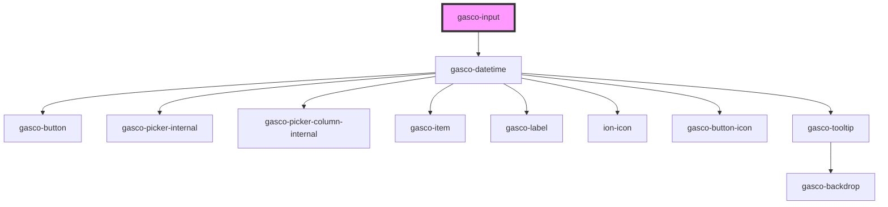

# gasco-input

<!-- Auto Generated Below -->

## Properties

| Property          | Attribute           | Description                                                                                                                                                                                                                                                                                                                                                                                                                                                                       | Type                                                                                                                                                                                                                                                                                                                                                                                                                                                                                                                                                                                                                                                                                                                                                                                                                                                                                                                        | Default        |
| ----------------- | ------------------- | --------------------------------------------------------------------------------------------------------------------------------------------------------------------------------------------------------------------------------------------------------------------------------------------------------------------------------------------------------------------------------------------------------------------------------------------------------------------------------- | --------------------------------------------------------------------------------------------------------------------------------------------------------------------------------------------------------------------------------------------------------------------------------------------------------------------------------------------------------------------------------------------------------------------------------------------------------------------------------------------------------------------------------------------------------------------------------------------------------------------------------------------------------------------------------------------------------------------------------------------------------------------------------------------------------------------------------------------------------------------------------------------------------------------------- | -------------- |
| `autocapitalize`  | `autocapitalize`    | Indicates whether and how the text value should be automatically capitalized as it is entered/edited by the user. Available options: `off`, `none`, `on`, `sentences`, `words`, `characters`.                                                                                                                                                                                                                                                                                     | `string`                                                                                                                                                                                                                                                                                                                                                                                                                                                                                                                                                                                                                                                                                                                                                                                                                                                                                                                    | `'off'`        |
| `autocomplete`    | `autocomplete`      | Indicates whther the value of the control can be automatically completed by the browser.                                                                                                                                                                                                                                                                                                                                                                                          | `"on" \| "off" \| "name" \| "honorific-prefix" \| "given-name" \| "additional-name" \| "family-name" \| "honorific-suffix" \| "nickname" \| "email" \| "username" \| "new-password" \| "current-password" \| "one-time-code" \| "organization-title" \| "organization" \| "street-address" \| "address-line1" \| "address-line2" \| "address-line3" \| "address-level4" \| "address-level3" \| "address-level2" \| "address-level1" \| "country" \| "country-name" \| "postal-code" \| "cc-name" \| "cc-given-name" \| "cc-additional-name" \| "cc-family-name" \| "cc-number" \| "cc-exp" \| "cc-exp-month" \| "cc-exp-year" \| "cc-csc" \| "cc-type" \| "transaction-currency" \| "transaction-amount" \| "language" \| "bday" \| "bday-day" \| "bday-month" \| "bday-year" \| "sex" \| "tel" \| "tel-country-code" \| "tel-national" \| "tel-area-code" \| "tel-local" \| "tel-extension" \| "impp" \| "url" \| "photo"` | `'off'`        |
| `autocorrect`     | `autocorrect`       | Whether auto correction should be enabled when the user is entering/editind the text value.                                                                                                                                                                                                                                                                                                                                                                                       | `"off" \| "on"`                                                                                                                                                                                                                                                                                                                                                                                                                                                                                                                                                                                                                                                                                                                                                                                                                                                                                                             | `'off'`        |
| `autofocus`       | `autofocus`         | This Boolean attributes lets you specify that a from control should have input focus when the page loads.                                                                                                                                                                                                                                                                                                                                                                         | `boolean`                                                                                                                                                                                                                                                                                                                                                                                                                                                                                                                                                                                                                                                                                                                                                                                                                                                                                                                   | `false`        |
| `calendar`        | `calendar`          | If `true`, the user cannot interact with the calendar.                                                                                                                                                                                                                                                                                                                                                                                                                            | `boolean`                                                                                                                                                                                                                                                                                                                                                                                                                                                                                                                                                                                                                                                                                                                                                                                                                                                                                                                   | `false`        |
| `color`           | `color`             | The color to use from your application's color palette. Default options are: `primary`, `secondary`, `tertiary`, `success`, `warning`, `danger`, `light`, and `dark`.                                                                                                                                                                                                                                                                                                             | `"danger" \| "dark" \| "light" \| "medium" \| "primary" \| "secondary" \| "success" \| "tertiary" \| "warning" \| string & Record<never, never>`                                                                                                                                                                                                                                                                                                                                                                                                                                                                                                                                                                                                                                                                                                                                                                            | `undefined`    |
| `disabled`        | `disabled`          | If `true`, the user cannot interact with the input.                                                                                                                                                                                                                                                                                                                                                                                                                               | `boolean`                                                                                                                                                                                                                                                                                                                                                                                                                                                                                                                                                                                                                                                                                                                                                                                                                                                                                                                   | `false`        |
| `fireFocusEvents` | `fire-focus-events` |                                                                                                                                                                                                                                                                                                                                                                                                                                                                                   | `boolean`                                                                                                                                                                                                                                                                                                                                                                                                                                                                                                                                                                                                                                                                                                                                                                                                                                                                                                                   | `true`         |
| `indicator`       | `indicator`         | Instructional text that show before the input has a value. The Input numeric for flat country.                                                                                                                                                                                                                                                                                                                                                                                    | `boolean`                                                                                                                                                                                                                                                                                                                                                                                                                                                                                                                                                                                                                                                                                                                                                                                                                                                                                                                   | `undefined`    |
| `inputmode`       | `inputmode`         | A hint to the browser for which keyboard to display. Possible values: `none`, `text`, `tel`, `url`, `email, `numeric`, `decimal`, `search`.                                                                                                                                                                                                                                                                                                                                       | `"decimal" \| "email" \| "none" \| "numeric" \| "search" \| "tel" \| "text" \| "url"`                                                                                                                                                                                                                                                                                                                                                                                                                                                                                                                                                                                                                                                                                                                                                                                                                                       | `undefined`    |
| `label`           | `label`             | Instructional text that show before the input has a value. The Input label.                                                                                                                                                                                                                                                                                                                                                                                                       | `string`                                                                                                                                                                                                                                                                                                                                                                                                                                                                                                                                                                                                                                                                                                                                                                                                                                                                                                                    | `undefined`    |
| `limit`           | `limit`             | Instructional text that show before the input has a value. The Input text help.                                                                                                                                                                                                                                                                                                                                                                                                   | `boolean`                                                                                                                                                                                                                                                                                                                                                                                                                                                                                                                                                                                                                                                                                                                                                                                                                                                                                                                   | `undefined`    |
| `max`             | `max`               | The maximum value, which must not be less than its minimum (min attribute) value.                                                                                                                                                                                                                                                                                                                                                                                                 | `number \| string`                                                                                                                                                                                                                                                                                                                                                                                                                                                                                                                                                                                                                                                                                                                                                                                                                                                                                                          | `undefined`    |
| `maxlength`       | `maxlength`         | If the value of the type attribute is `text`, `email`, `search`, `password`, `tel`, or `url`, this attribute specifies the maximum number of characters that the user can enter.                                                                                                                                                                                                                                                                                                  | `number`                                                                                                                                                                                                                                                                                                                                                                                                                                                                                                                                                                                                                                                                                                                                                                                                                                                                                                                    | `undefined`    |
| `min`             | `min`               | The minimum value, which must not be greater than its maximum (max attribute) value.                                                                                                                                                                                                                                                                                                                                                                                              | `number \| string`                                                                                                                                                                                                                                                                                                                                                                                                                                                                                                                                                                                                                                                                                                                                                                                                                                                                                                          | `undefined`    |
| `minlength`       | `minlength`         | If the value of the type attribute is `text`, `email`, `search`, `password`, `tel`, or `url`, this attribute specifies the minimum number of characters that the user can enter.                                                                                                                                                                                                                                                                                                  | `number`                                                                                                                                                                                                                                                                                                                                                                                                                                                                                                                                                                                                                                                                                                                                                                                                                                                                                                                    | `undefined`    |
| `multiple`        | `multiple`          | If `true`, the user can enter more than one value. This attribute applies when the type attribute is set to `email`, otherwise it is ignored.                                                                                                                                                                                                                                                                                                                                     | `boolean`                                                                                                                                                                                                                                                                                                                                                                                                                                                                                                                                                                                                                                                                                                                                                                                                                                                                                                                   | `undefined`    |
| `name`            | `name`              | The name of the control, which is submitted with the form data.                                                                                                                                                                                                                                                                                                                                                                                                                   | `string`                                                                                                                                                                                                                                                                                                                                                                                                                                                                                                                                                                                                                                                                                                                                                                                                                                                                                                                    | `this.inputId` |
| `pattern`         | `pattern`           | A regular expression that the value is checked against. The pattern must match the entire value, not just some subset. Use the title attribute to describe the pattern to help the user. This attribute applies when the value of the type attribute is `text`, `search`, `tel`, `url`, `email`, `"date"`, or `password`, otherwise it is ignored. When the type attribute is `date`, `pattern` will only be used in browsers that do not support the `date` input type natively. | `string`                                                                                                                                                                                                                                                                                                                                                                                                                                                                                                                                                                                                                                                                                                                                                                                                                                                                                                                    | `undefined`    |
| `placeholder`     | `placeholder`       | Instructional text that show before the input has a value. This property applies only whe the `type` property is set to `email`, `number`, `password`, `search`, `tel`, `text`, or `url`, otherwise it is ignored.                                                                                                                                                                                                                                                                | `string`                                                                                                                                                                                                                                                                                                                                                                                                                                                                                                                                                                                                                                                                                                                                                                                                                                                                                                                    | `undefined`    |
| `readonly`        | `readonly`          | If `true`, the user cannot modify the value.                                                                                                                                                                                                                                                                                                                                                                                                                                      | `boolean`                                                                                                                                                                                                                                                                                                                                                                                                                                                                                                                                                                                                                                                                                                                                                                                                                                                                                                                   | `false`        |
| `required`        | `required`          | If `true`, the user must fill in a value before submitting a form.                                                                                                                                                                                                                                                                                                                                                                                                                | `boolean`                                                                                                                                                                                                                                                                                                                                                                                                                                                                                                                                                                                                                                                                                                                                                                                                                                                                                                                   | `false`        |
| `size`            | `size`              | The Input size.                                                                                                                                                                                                                                                                                                                                                                                                                                                                   | `"default" \| "large" \| "small"`                                                                                                                                                                                                                                                                                                                                                                                                                                                                                                                                                                                                                                                                                                                                                                                                                                                                                           | `undefined`    |
| `spellcheck`      | `spellcheck`        | If `true`, the element will have its spelling and grammar checked.                                                                                                                                                                                                                                                                                                                                                                                                                | `boolean`                                                                                                                                                                                                                                                                                                                                                                                                                                                                                                                                                                                                                                                                                                                                                                                                                                                                                                                   | `false`        |
| `step`            | `step`              | Works with the min and max attributes to limit the increments at which a value can be set. Possible values are: `any` or a positive floating point number.                                                                                                                                                                                                                                                                                                                        | `string`                                                                                                                                                                                                                                                                                                                                                                                                                                                                                                                                                                                                                                                                                                                                                                                                                                                                                                                    | `undefined`    |
| `textHelp`        | `text-help`         | Instructional text that show before the input has a value. The Input text help.                                                                                                                                                                                                                                                                                                                                                                                                   | `string`                                                                                                                                                                                                                                                                                                                                                                                                                                                                                                                                                                                                                                                                                                                                                                                                                                                                                                                    | `undefined`    |
| `type`            | `type`              | The type of control to display. The default type is `text`.                                                                                                                                                                                                                                                                                                                                                                                                                       | `"date" \| "datetime-local" \| "email" \| "month" \| "number" \| "password" \| "search" \| "tel" \| "text" \| "time" \| "url" \| "week"`                                                                                                                                                                                                                                                                                                                                                                                                                                                                                                                                                                                                                                                                                                                                                                                    | `'text'`       |
| `value`           | `value`             | The value of the input.                                                                                                                                                                                                                                                                                                                                                                                                                                                           | `number \| string`                                                                                                                                                                                                                                                                                                                                                                                                                                                                                                                                                                                                                                                                                                                                                                                                                                                                                                          | `''`           |

## Events

| Event                | Description                                   | Type                                  |
| -------------------- | --------------------------------------------- | ------------------------------------- |
| `gascoBlur`          | Emitted when the input loses focus.           | `CustomEvent<FocusEvent>`             |
| `gascoChange`        | Emitted when the value has changed.           | `CustomEvent<InputChangeEventDetail>` |
| `gascoFocus`         | Emitted when the input has focus.             | `CustomEvent<FocusEvent>`             |
| `gascoFocusDatetime` | Emitted when the input has focus to datetime. | `CustomEvent<any>`                    |
| `gascoInput`         | Emitted when a keyboard input occurred.       | `CustomEvent<InputEvent>`             |

## Methods

### `getInputElement() => Promise<HTMLInputElement>`

Returns the native `<input>` element used under the hood.

#### Returns

Type: `Promise<HTMLInputElement>`

### `setFocus() => Promise<void>`

Sets focus on the native `input` in `gasco-input`. Use this method instead of the global
`input.focus()`.

#### Returns

Type: `Promise<void>`

## CSS Custom Properties

| Name                        | Description                                                                                              |
| --------------------------- | -------------------------------------------------------------------------------------------------------- |
| `--background`              | Background of the input                                                                                  |
| `--color`                   | Color of the input text                                                                                  |
| `--padding-bottom`          | Bottom padding of the input                                                                              |
| `--padding-end`             | Right padding if direction is left-to-right, and left padding if direction is right-to-left of the input |
| `--padding-start`           | Left padding if direction is left-to-right, and right padding if direction is right-to-left of the input |
| `--padding-top`             | Top padding of the input                                                                                 |
| `--placeholder-color`       | Color of the input placeholder text                                                                      |
| `--placeholder-font-style`  | Font style of the input placeholder text                                                                 |
| `--placeholder-font-weight` | Font weight of the input placeholder text                                                                |
| `--placeholder-opacity`     | Opacity of the input placeholder text                                                                    |

## Dependencies

### Depends on

- [gasco-datetime](../gasco-datetime)

### Graph

----------------------------------------------

*Built with [StencilJS](https://stenciljs.com/)*
