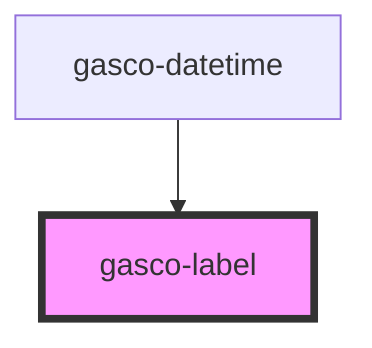

# gasco-label

<!-- Auto Generated Below -->

## Properties

| Property   | Attribute  | Description                                                                                                                                                                                                                                                            | Type                                                                                                                                             | Default     |
| ---------- | ---------- | ---------------------------------------------------------------------------------------------------------------------------------------------------------------------------------------------------------------------------------------------------------------------- | ------------------------------------------------------------------------------------------------------------------------------------------------ | ----------- |
| `color`    | `color`    | The color to use from your application's color palette. Default options are: `"primary"`, `"secondary"`, `"tertiary"`, `"success"`, `"warning"`, `"danger"`, `"light"`, `"medium"`, and `"dark"`. For more information on colors, see [theming](/docs/theming/basics). | `"danger" \| "dark" \| "light" \| "medium" \| "primary" \| "secondary" \| "success" \| "tertiary" \| "warning" \| string & Record<never, never>` | `undefined` |
| `position` | `position` | The position determines where and how the label behaves inside an item.                                                                                                                                                                                                | `"fixed" \| "floating" \| "stacked"`                                                                                                             | `undefined` |

## CSS Custom Properties

| Name      | Description        |
| --------- | ------------------ |
| `--color` | Color of the label |

## Dependencies

### Used by

 - [gasco-datetime](../gasco-datetime)

### Graph

----------------------------------------------

*Built with [StencilJS](https://stenciljs.com/)*
