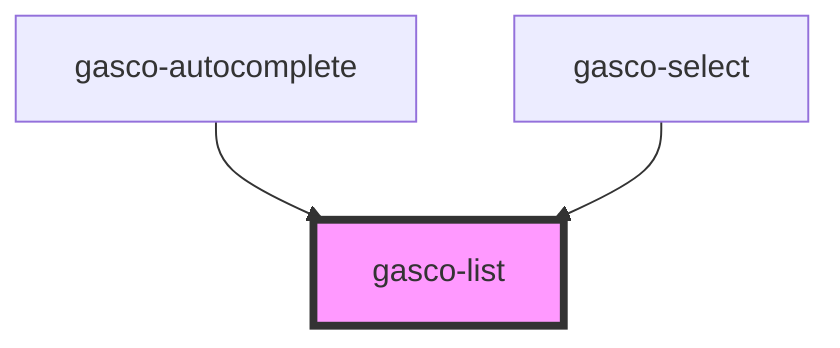

# gasco-list

<!-- Auto Generated Below -->

## Properties

| Property | Attribute | Description                                                         | Type                          | Default     |
| -------- | --------- | ------------------------------------------------------------------- | ----------------------------- | ----------- |
| `inset`  | `inset`   | If `true`, the list will have margin around it and rounded corners. | `boolean`                     | `false`     |
| `lines`  | `lines`   | How the bottom border should be displayed on all items.             | `"full" \| "inset" \| "none"` | `undefined` |

## Dependencies

### Used by

 - [gasco-autocomplete](../gasco-autocomplete)
 - [gasco-select](../gasco-select)

### Graph

----------------------------------------------

*Built with [StencilJS](https://stenciljs.com/)*
