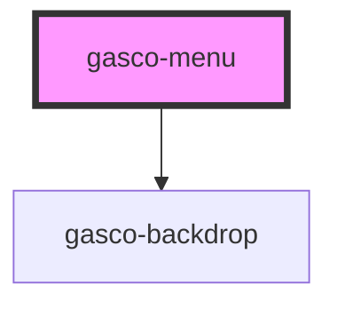

# gasco-menu

<!-- Auto Generated Below -->

## Properties

| Property       | Attribute        | Description                                                                                                                                                                                                                                    | Type               | Default     |
| -------------- | ---------------- | ---------------------------------------------------------------------------------------------------------------------------------------------------------------------------------------------------------------------------------------------- | ------------------ | ----------- |
| `contentId`    | `content-id`     | The `id` of the main content. When using a router this is typically `gasco-router-outlet`. When not using a router, this is typically your main view's `gasco-content`. This is not the id of the `gasco-content` inside of your `gasco-menu`. | `string`           | `undefined` |
| `disabled`     | `disabled`       | If `true`, the menu is disabled.                                                                                                                                                                                                               | `boolean`          | `false`     |
| `maxEdgeStart` | `max-edge-start` | The edge threshold for dragging the menu open. If a drag/swipe happens over this value, the menu is not triggered.                                                                                                                             | `number`           | `50`        |
| `menuId`       | `menu-id`        | An id for the menu.                                                                                                                                                                                                                            | `string`           | `undefined` |
| `side`         | `side`           | Which side of the view the menu should be placed.                                                                                                                                                                                              | `"end" \| "start"` | `'start'`   |
| `swipeGesture` | `swipe-gesture`  | If `true`, swiping the menu is enabled.                                                                                                                                                                                                        | `boolean`          | `true`      |
| `type`         | `type`           | The display type of the menu. Available options: `"overlay"`, `"reveal"`, `"push"`.                                                                                                                                                            | `string`           | `undefined` |

## Events

| Event            | Description                                  | Type                |
| ---------------- | -------------------------------------------- | ------------------- |
| `gascoDidClose`  | Emitted when the menu is closed.             | `CustomEvent<void>` |
| `gascoDidOpen`   | Emitted when the menu is open.               | `CustomEvent<void>` |
| `gascoWillClose` | Emitted when the menu is about to be closed. | `CustomEvent<void>` |
| `gascoWillOpen`  | Emitted when the menu is about to be opened. | `CustomEvent<void>` |

## Methods

### `close(animated?: boolean) => Promise<boolean>`

Closes the menu. If the menu is already closed or it can't be closed,
it returns `false`.

#### Returns

Type: `Promise<boolean>`

### `isActive() => Promise<boolean>`

Returns `true` is the menu is active.

A menu is active when it can be opened or closed, meaning it's enabled
and it's not part of a `gasco-split-pane`.

#### Returns

Type: `Promise<boolean>`

### `isOpen() => Promise<boolean>`

Returns `true` is the menu is open.

#### Returns

Type: `Promise<boolean>`

### `open(animated?: boolean) => Promise<boolean>`

Opens the menu. If the menu is already open or it can't be opened,
it returns `false`.

#### Returns

Type: `Promise<boolean>`

### `setOpen(shouldOpen: boolean, animated?: boolean) => Promise<boolean>`

Opens or closes the button.
If the operation can't be completed successfully, it returns `false`.

#### Returns

Type: `Promise<boolean>`

### `toggle(animated?: boolean) => Promise<boolean>`

Toggles the menu. If the menu is already open, it will try to close, otherwise it will try to open it.
If the operation can't be completed successfully, it returns `false`.

#### Returns

Type: `Promise<boolean>`

## Shadow Parts

| Part          | Description                                                            |
| ------------- | ---------------------------------------------------------------------- |
| `"backdrop"`  | The backdrop that appears over the main content when the menu is open. |
| `"container"` | The container for the menu content.                                    |

## CSS Custom Properties

| Name           | Description                |
| -------------- | -------------------------- |
| `--background` | Background of the menu     |
| `--height`     | Height of the menu         |
| `--max-height` | Maximum height of the menu |
| `--max-width`  | Maximum width of the menu  |
| `--min-height` | Minimum height of the menu |
| `--min-width`  | Minimum width of the menu  |
| `--width`      | Width of the menu          |

## Dependencies

### Depends on

- [gasco-backdrop](../gasco-backdrop)

### Graph

----------------------------------------------

*Built with [StencilJS](https://stenciljs.com/)*
