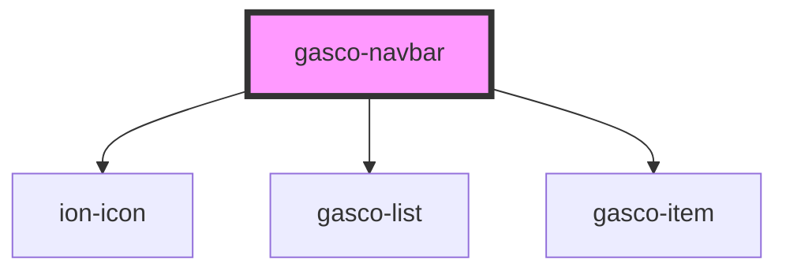

# gasco-navbar

<!-- Auto Generated Below -->

## Properties

| Property   | Attribute  | Description | Type                                                                                                                                             | Default      |
| ---------- | ---------- | ----------- | ------------------------------------------------------------------------------------------------------------------------------------------------ | ------------ |
| `color`    | `color`    |             | `"danger" \| "dark" \| "light" \| "medium" \| "primary" \| "secondary" \| "success" \| "tertiary" \| "warning" \| string & Record<never, never>` | `'primary'`  |
| `position` | `position` |             | `"relative" \| "sticky"`                                                                                                                         | `'relative'` |
| `user`     | --         |             | `INavbarUser`                                                                                                                                    | `undefined`  |
| `usernav`  | --         |             | `INavbarUserNav[]`                                                                                                                               | `undefined`  |

## Events

| Event                   | Description | Type                            |
| ----------------------- | ----------- | ------------------------------- |
| `gascoSetUserToSidebar` |             | `CustomEvent<IGetUserOfNavbar>` |
| `gascoSidebarShow`      |             | `CustomEvent<any>`              |

## Shadow Parts

| Part       | Description |
| ---------- | ----------- |
| `"native"` |             |

## Dependencies

### Depends on

- ion-icon
- [gasco-list](../gasco-list)
- [gasco-item](../gasco-item)

### Graph

----------------------------------------------

*Built with [StencilJS](https://stenciljs.com/)*
