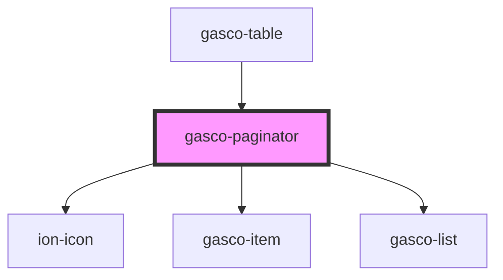

# gasco-paginator

<!-- Auto Generated Below -->

## Properties

| Property         | Attribute      | Description                                     | Type                      | Default     |
| ---------------- | -------------- | ----------------------------------------------- | ------------------------- | ----------- |
| `currentPage`    | `current-page` |                                                 | `number`                  | `1`         |
| `htmlAttributes` | --             | Additional attributes to pass to the pagiantor. | `{ [key: string]: any; }` | `undefined` |
| `pageSize`       | `page-size`    |                                                 | `number`                  | `10`        |
| `suggestionList` | --             |                                                 | `number[]`                | `undefined` |
| `totalItems`     | `total-items`  |                                                 | `number`                  | `undefined` |

## Events

| Event         | Description | Type                                      |
| ------------- | ----------- | ----------------------------------------- |
| `gascoChange` |             | `CustomEvent<PaginatorChangeEventDetail>` |
| `gascoReady`  |             | `CustomEvent<PaginatorReadyEventDetail>`  |
| `sizeChanged` |             | `CustomEvent<any>`                        |

## Dependencies

### Used by

 - [gasco-table](../gasco-table)

### Depends on

- ion-icon
- [gasco-item](../gasco-item)
- [gasco-list](../gasco-list)

### Graph

----------------------------------------------

*Built with [StencilJS](https://stenciljs.com/)*
