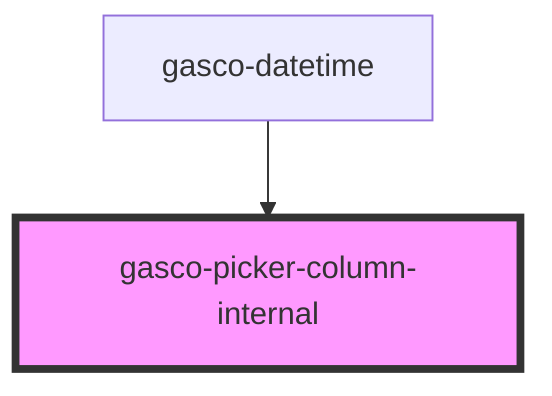

# gasco-picker-column-internal

<!-- Auto Generated Below -->

## Properties

| Property | Attribute | Description                                                                                                                                       | Type                                                                                                                                             | Default     |
| -------- | --------- | ------------------------------------------------------------------------------------------------------------------------------------------------- | ------------------------------------------------------------------------------------------------------------------------------------------------ | ----------- |
| `color`  | `color`   | The color to use from your application's color palette. Default options are: `"primary"`, `"secondary"`, `"success"`, `"warning"` and `"danger"`. | `"danger" \| "dark" \| "light" \| "medium" \| "primary" \| "secondary" \| "success" \| "tertiary" \| "warning" \| string & Record<never, never>` | `'primary'` |
| `items`  | --        | A list of options to be displayed in the picker                                                                                                   | `PickerColumnItem[]`                                                                                                                             | `[]`        |
| `value`  | `value`   | The selected option in the picker.                                                                                                                | `number \| string`                                                                                                                               | `undefined` |

## Events

| Event         | Description                         | Type                            |
| ------------- | ----------------------------------- | ------------------------------- |
| `gascoChange` | Emitted when the value has changed. | `CustomEvent<PickerColumnItem>` |

## Dependencies

### Used by

 - [gasco-datetime](../gasco-datetime)

### Graph

----------------------------------------------

*Built with [StencilJS](https://stenciljs.com/)*
