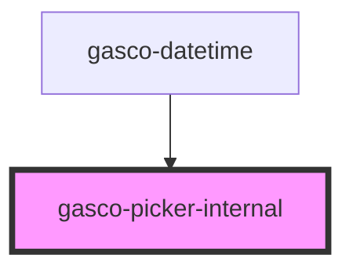

# gasco-picker-internal

<!-- Auto Generated Below -->

## Events

| Event                  | Description | Type                                           |
| ---------------------- | ----------- | ---------------------------------------------- |
| `gascoInputModeChange` |             | `CustomEvent<PickerInternalChangeEventDetail>` |

## Dependencies

### Used by

 - [gasco-datetime](../gasco-datetime)

### Graph

----------------------------------------------

*Built with [StencilJS](https://stenciljs.com/)*
