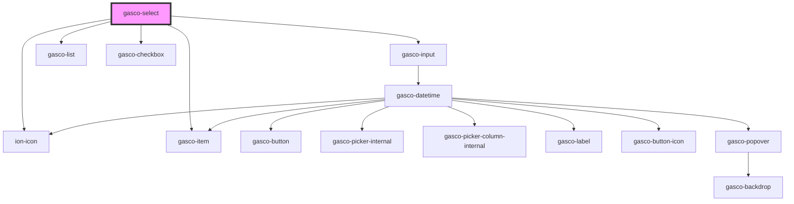

# gasco-select

<!-- Auto Generated Below -->

## Properties

| Property      | Attribute     | Description                                                                 | Type                     | Default                    |
| ------------- | ------------- | --------------------------------------------------------------------------- | ------------------------ | -------------------------- |
| `choices`     | --            |                                                                             | `IChoiceProp[]`          | `undefined`                |
| `disabled`    | `disabled`    | If `true`, the user cannot interact with the select.                        | `boolean`                | `false`                    |
| `label`       | `label`       | Instructional text that show before the input has a value. The Input label. | `string`                 | `undefined`                |
| `name`        | `name`        | The name of the control, which is submitted with the form data.             | `string`                 | `this.selectId`            |
| `placeholder` | `placeholder` | Instructional text that show before the input has a value.                  | `string`                 | `'Seleccione un elemento'` |
| `type`        | `type`        |                                                                             | `"multiple" \| "simple"` | `'simple'`                 |

## Events

| Event               | Description | Type                         |
| ------------------- | ----------- | ---------------------------- |
| `gascoChangeSelect` |             | `CustomEvent<IChoiceDetail>` |
| `gascoReady`        |             | `CustomEvent<any>`           |

## Dependencies

### Depends on

- [gasco-input](../gasco-input)
- ion-icon
- [gasco-list](../gasco-list)
- [gasco-item](../gasco-item)
- [gasco-checkbox](../gasco-checkbox)

### Graph

----------------------------------------------

*Built with [StencilJS](https://stenciljs.com/)*
