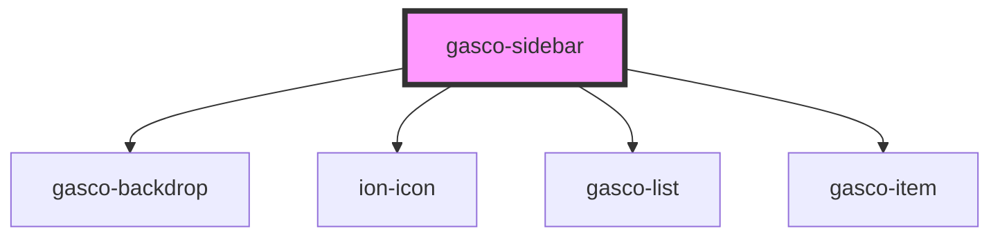

# gasco-sidebar

<!-- Auto Generated Below -->

## Properties

| Property | Attribute | Description                                                                                                                                      | Type                                                                                                                                             | Default     |
| -------- | --------- | ------------------------------------------------------------------------------------------------------------------------------------------------ | ------------------------------------------------------------------------------------------------------------------------------------------------ | ----------- |
| `color`  | `color`   | The color to use from your application's color palette. Default options are: `"primary"`, `"secondary"`, `"success"`, `"warning"`, `"danger"`.   | `"danger" \| "dark" \| "light" \| "medium" \| "primary" \| "secondary" \| "success" \| "tertiary" \| "warning" \| string & Record<never, never>` | `'primary'` |
| `isOpen` | `is-open` | If 'true', the `gasco-sidebar` will be inicialized open, defaul is `false`.                                                                      | `boolean`                                                                                                                                        | `false`     |
| `size`   | `size`    | If `cover`, the `gasco-sidebar` will expand to cover the full height of its container. If `fixed`, the `gasco-sidebar` will have a fixed height. | `"cover" \| "fixed"`                                                                                                                             | `'fixed'`   |

## Shadow Parts

| Part       | Description |
| ---------- | ----------- |
| `"native"` |             |

## Dependencies

### Depends on

- [gasco-backdrop](../gasco-backdrop)
- ion-icon
- [gasco-list](../gasco-list)
- [gasco-item](../gasco-item)

### Graph

----------------------------------------------

*Built with [StencilJS](https://stenciljs.com/)*
