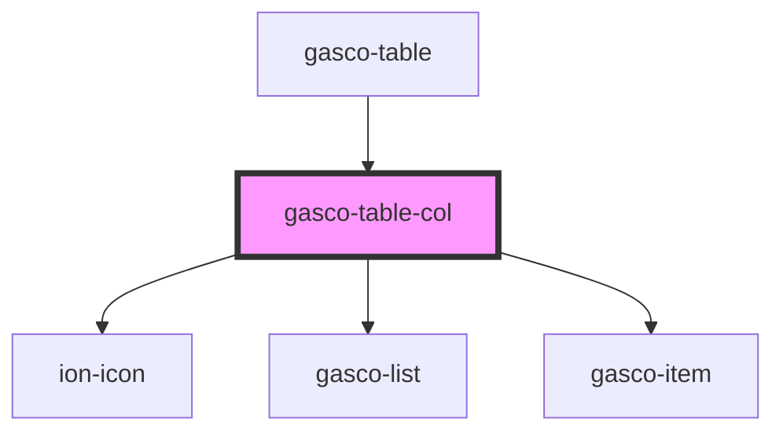

# gasco-table-col

<!-- Auto Generated Below -->

## Properties

| Property     | Attribute     | Description | Type      | Default     |
| ------------ | ------------- | ----------- | --------- | ----------- |
| `action`     | `action`      |             | `boolean` | `undefined` |
| `typeAction` | `type-action` |             | `string`  | `undefined` |

## Events

| Event                  | Description | Type                               |
| ---------------------- | ----------- | ---------------------------------- |
| `gascoTableTypeAction` |             | `CustomEvent<ITableColTypeAction>` |

## Shadow Parts

| Part       | Description |
| ---------- | ----------- |
| `"native"` |             |

## Dependencies

### Used by

 - [gasco-table](../gasco-table)

### Depends on

- ion-icon
- [gasco-list](../gasco-list)
- [gasco-item](../gasco-item)

### Graph

----------------------------------------------

*Built with [StencilJS](https://stenciljs.com/)*
