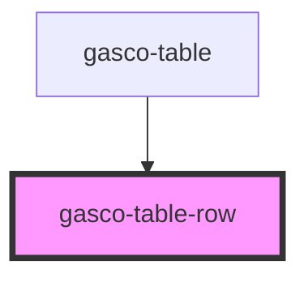

# gasco-table-row

<!-- Auto Generated Below -->

## Properties

| Property | Attribute | Description | Type      | Default |
| -------- | --------- | ----------- | --------- | ------- |
| `header` | `header`  |             | `boolean` | `false` |

## Dependencies

### Used by

 - [gasco-table](../gasco-table)

### Graph

----------------------------------------------

*Built with [StencilJS](https://stenciljs.com/)*
