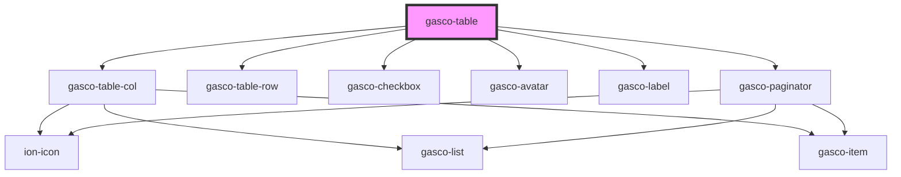

# gasco-table

<!-- Auto Generated Below -->

## Properties

| Property         | Attribute      | Description                                                                                        | Type            | Default        |
| ---------------- | -------------- | -------------------------------------------------------------------------------------------------- | --------------- | -------------- |
| `currentPage`    | `current-page` | If it is `1`, `pageSize` will be shown, which is equivalent to the elements that you want to show. | `number`        | `1`            |
| `pageSize`       | `page-size`    | Number of elements to show this taking into account that it will always be 10 + 10.                | `number`        | `10`           |
| `pagination`     | `pagination`   |                                                                                                    | `boolean`       | `true`         |
| `suggestionList` | --             | Amounts of items to display, this may vary depending on the user.                                  | `number[]`      | `[10, 20, 30]` |
| `totalItems`     | `total-items`  | Taking into account the number of elements to display by default it is `undefined`.                | `number`        | `undefined`    |
| `users`          | --             | The number of users to display.                                                                    | `ITableUsers[]` | `undefined`    |

## Events

| Event              | Description | Type                               |
| ------------------ | ----------- | ---------------------------------- |
| `gascoTableAction` |             | `CustomEvent<ITableColTypeAction>` |

## Shadow Parts

| Part       | Description |
| ---------- | ----------- |
| `"native"` |             |

## Dependencies

### Depends on

- [gasco-table-col](../gasco-table-col)
- [gasco-table-row](../gasco-table-row)
- [gasco-checkbox](../gasco-checkbox)
- [gasco-avatar](../gasco-avatar)
- [gasco-label](../gasco-label)
- [gasco-paginator](../gasco-paginator)

### Graph

----------------------------------------------

*Built with [StencilJS](https://stenciljs.com/)*
