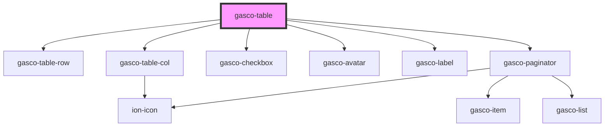

# gasco-table

<!-- Auto Generated Below -->

## Properties

| Property     | Attribute    | Description | Type            | Default     |
| ------------ | ------------ | ----------- | --------------- | ----------- |
| `pagination` | `pagination` |             | `boolean`       | `true`      |
| `users`      | --           |             | `ITableUsers[]` | `undefined` |

## Shadow Parts

| Part       | Description |
| ---------- | ----------- |
| `"native"` |             |

## Dependencies

### Depends on

- [gasco-table-row](../gasco-table-row)
- [gasco-table-col](../gasco-table-col)
- [gasco-checkbox](../gasco-checkbox)
- [gasco-avatar](../gasco-avatar)
- [gasco-label](../gasco-label)
- [gasco-paginator](../gasco-paginator)

### Graph

----------------------------------------------

*Built with [StencilJS](https://stenciljs.com/)*
