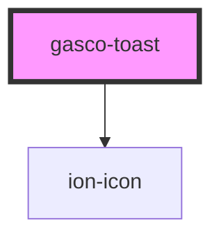

# gasco-toast

<!-- Auto Generated Below -->

## Properties

| Property         | Attribute        | Description                                                                                                                                                                                       | Type                                                                                                                                             | Default     |
| ---------------- | ---------------- | ------------------------------------------------------------------------------------------------------------------------------------------------------------------------------------------------- | ------------------------------------------------------------------------------------------------------------------------------------------------ | ----------- |
| `animated`       | `animated`       | If `true`, the toast will animate.                                                                                                                                                                | `boolean`                                                                                                                                        | `true`      |
| `buttons`        | --               | An array of buttons for the toast.                                                                                                                                                                | `(string \| ToastButton)[]`                                                                                                                      | `undefined` |
| `color`          | `color`          | The color to use from your application's color palette. Default options are: `"primary"`, `"secondary"`, `"tertiary"`, `"success"`, `"warning"`, `"danger"`, `"light"`, `"medium"`, and `"dark"`. | `"danger" \| "dark" \| "light" \| "medium" \| "primary" \| "secondary" \| "success" \| "tertiary" \| "warning" \| string & Record<never, never>` | `undefined` |
| `cssClass`       | `css-class`      | Additional classes to apply for custom CSS. If multiple classes are provided they should be separated by spaces.                                                                                  | `string \| string[]`                                                                                                                             | `undefined` |
| `duration`       | `duration`       | How many milliseconds to wait before hiding the toast. By default, it will show until `dismiss()` is called.                                                                                      | `number`                                                                                                                                         | `0`         |
| `enterAnimation` | --               | Animation to use when the toast is presented.                                                                                                                                                     | `(baseEl: any, opts?: any) => Animation`                                                                                                         | `undefined` |
| `header`         | `header`         | Header to be shown in the toast.                                                                                                                                                                  | `string`                                                                                                                                         | `undefined` |
| `htmlAttributes` | --               | Additional attributes to pass to the toast.                                                                                                                                                       | `{ [key: string]: any; }`                                                                                                                        | `undefined` |
| `icon`           | `icon`           | The name of the icon to display, or the path to a valid SVG file. See `ion-icon`. https://ionic.io/ionicons                                                                                       | `string`                                                                                                                                         | `undefined` |
| `keyboardClose`  | `keyboard-close` | If `true`, the keyboard will be automatically dismissed when the overlay is presented.                                                                                                            | `boolean`                                                                                                                                        | `false`     |
| `leaveAnimation` | --               | Animation to use when the toast is dismissed.                                                                                                                                                     | `(baseEl: any, opts?: any) => Animation`                                                                                                         | `undefined` |
| `message`        | `message`        | Message to be shown in the toast.                                                                                                                                                                 | `GascoSafeString \| string`                                                                                                                      | `undefined` |
| `position`       | `position`       | The position of the toast on the screen.                                                                                                                                                          | `"bottom" \| "middle" \| "top"`                                                                                                                  | `'bottom'`  |

## Events

| Event                   | Description                             | Type                                   |
| ----------------------- | --------------------------------------- | -------------------------------------- |
| `gascoToastDidDismiss`  | Emitted after the toast has dismissed.  | `CustomEvent<OverlayEventDetail<any>>` |
| `gascoToastDidPresent`  | Emitted after the toast has presented.  | `CustomEvent<void>`                    |
| `gascoToastWillDismiss` | Emitted before the toast has dismissed. | `CustomEvent<OverlayEventDetail<any>>` |
| `gascoToastWillPresent` | Emitted before the toast has presented. | `CustomEvent<void>`                    |

## Methods

### `dismiss(data?: any, role?: string) => Promise<boolean>`

Dismiss the toast overlay after it has been presented.

#### Returns

Type: `Promise<boolean>`

### `onDidDismiss<T = any>() => Promise<OverlayEventDetail<T>>`

Returns a promise that resolves when the toast did dismiss.

#### Returns

Type: `Promise<OverlayEventDetail<T>>`

### `onWillDismiss<T = any>() => Promise<OverlayEventDetail<T>>`

Returns a promise that resolves when the toast will dismiss.

#### Returns

Type: `Promise<OverlayEventDetail<T>>`

### `present() => Promise<void>`

Present the toast overlay after it has been created.

#### Returns

Type: `Promise<void>`

## Shadow Parts

| Part          | Description                                               |
| ------------- | --------------------------------------------------------- |
| `"button"`    | Any button element that is displayed inside of the toast. |
| `"container"` | The element that wraps all child elements.                |
| `"header"`    | The header text of the toast.                             |
| `"icon"`      | The icon that appears next to the toast content.          |
| `"message"`   | The body text of the toast.                               |

## CSS Custom Properties

| Name              | Description                                                                                            |
| ----------------- | ------------------------------------------------------------------------------------------------------ |
| `--background`    | Background of the toast                                                                                |
| `--border-color`  | Border color of the toast                                                                              |
| `--border-radius` | Border radius of the toast                                                                             |
| `--border-style`  | Border style of the toast                                                                              |
| `--border-width`  | Border width of the toast                                                                              |
| `--box-shadow`    | Box shadow of the toast                                                                                |
| `--button-color`  | Color of the button text                                                                               |
| `--color`         | Color of the toast text                                                                                |
| `--end`           | Position from the right if direction is left-to-right, and from the left if direction is right-to-left |
| `--height`        | Height of the toast                                                                                    |
| `--max-height`    | Maximum height of the toast                                                                            |
| `--max-width`     | Maximum width of the toast                                                                             |
| `--min-height`    | Minimum height of the toast                                                                            |
| `--min-width`     | Minimum width of the toast                                                                             |
| `--start`         | Position from the left if direction is left-to-right, and from the right if direction is right-to-left |
| `--white-space`   | White space of the toast message                                                                       |
| `--width`         | Width of the toast                                                                                     |

## Dependencies

### Depends on

- ion-icon

### Graph

----------------------------------------------

*Built with [StencilJS](https://stenciljs.com/)*
