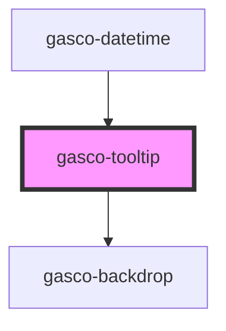

# gasco-tooltip

<!-- Auto Generated Below -->

## Properties

| Property          | Attribute           | Description                                                                                                                                                                                                                                                                                                                                                                                                                                                                                                                  | Type                                                         | Default     |
| ----------------- | ------------------- | ---------------------------------------------------------------------------------------------------------------------------------------------------------------------------------------------------------------------------------------------------------------------------------------------------------------------------------------------------------------------------------------------------------------------------------------------------------------------------------------------------------------------------- | ------------------------------------------------------------ | ----------- |
| `alignment`       | `alignment`         | Describes how to align the popover content with the `reference` point. Defaults to `'center'` for `ios` mode, and `'start'` for `md` mode.                                                                                                                                                                                                                                                                                                                                                                                   | `"center" \| "end" \| "start"`                               | `undefined` |
| `animated`        | `animated`          | If `true`, the popover will animate.                                                                                                                                                                                                                                                                                                                                                                                                                                                                                         | `boolean`                                                    | `true`      |
| `arrow`           | `arrow`             | If `true`, the popover will display an arrow that points at the `reference` when running in `ios` mode. Does not apply in `md` mode.                                                                                                                                                                                                                                                                                                                                                                                         | `boolean`                                                    | `true`      |
| `backdropDismiss` | `backdrop-dismiss`  | If `true`, the popover will be dismissed when the backdrop is clicked.                                                                                                                                                                                                                                                                                                                                                                                                                                                       | `boolean`                                                    | `true`      |
| `component`       | `component`         | The component to display inside of the popover. You only need to use this if you are not using a JavaScript framework. Otherwise, you can just slot your component inside of `ion-popover`.                                                                                                                                                                                                                                                                                                                                  | `Function \| HTMLElement \| string`                          | `undefined` |
| `componentProps`  | --                  | The data to pass to the popover component. You only need to use this if you are not using a JavaScript framework. Otherwise, you can just set the props directly on your component.                                                                                                                                                                                                                                                                                                                                          | `{ [key: string]: any; }`                                    | `undefined` |
| `dismissOnSelect` | `dismiss-on-select` | If `true`, the popover will be automatically dismissed when the content has been clicked.                                                                                                                                                                                                                                                                                                                                                                                                                                    | `boolean`                                                    | `false`     |
| `enterAnimation`  | --                  | Animation to use when the popover is presented.                                                                                                                                                                                                                                                                                                                                                                                                                                                                              | `(baseEl: any, opts?: any) => Animation`                     | `undefined` |
| `event`           | `event`             | The event to pass to the popover animation.                                                                                                                                                                                                                                                                                                                                                                                                                                                                                  | `any`                                                        | `undefined` |
| `htmlAttributes`  | --                  | Additional attributes to pass to the popover.                                                                                                                                                                                                                                                                                                                                                                                                                                                                                | `{ [key: string]: any; }`                                    | `undefined` |
| `isOpen`          | `is-open`           | If `true`, the popover will open. If `false`, the popover will close. Use this if you need finer grained control over presentation, otherwise just use the popoverController or the `trigger` property. Note: `isOpen` will not automatically be set back to `false` when the popover dismisses. You will need to do that in your code.                                                                                                                                                                                      | `boolean`                                                    | `false`     |
| `keyboardClose`   | `keyboard-close`    | If `true`, the keyboard will be automatically dismissed when the overlay is presented.                                                                                                                                                                                                                                                                                                                                                                                                                                       | `boolean`                                                    | `true`      |
| `leaveAnimation`  | --                  | Animation to use when the popover is dismissed.                                                                                                                                                                                                                                                                                                                                                                                                                                                                              | `(baseEl: any, opts?: any) => Animation`                     | `undefined` |
| `mode`            | `mode`              | The mode determines which platform styles to use.                                                                                                                                                                                                                                                                                                                                                                                                                                                                            | `"ios" \| "md"`                                              | `undefined` |
| `reference`       | `reference`         | Describes what to position the popover relative to. If `'trigger'`, the popover will be positioned relative to the trigger button. If passing in an event, this is determined via event.target. If `'event'`, the popover will be positioned relative to the x/y coordinates of the trigger action. If passing in an event, this is determined via event.clientX and event.clientY.                                                                                                                                          | `"event" \| "trigger"`                                       | `'trigger'` |
| `showBackdrop`    | `show-backdrop`     | If `true`, a backdrop will be displayed behind the popover. This property controls whether or not the backdrop darkens the screen when the popover is presented. It does not control whether or not the backdrop is active or present in the DOM.                                                                                                                                                                                                                                                                            | `boolean`                                                    | `true`      |
| `side`            | `side`              | Describes which side of the `reference` point to position the popover on. The `'start'` and `'end'` values are RTL-aware, and the `'left'` and `'right'` values are not.                                                                                                                                                                                                                                                                                                                                                     | `"bottom" \| "end" \| "left" \| "right" \| "start" \| "top"` | `'bottom'`  |
| `size`            | `size`              | Describes how to calculate the popover width. If `'cover'`, the popover width will match the width of the trigger. If `'auto'`, the popover width will be determined by the content in the popover.                                                                                                                                                                                                                                                                                                                          | `"auto" \| "cover"`                                          | `'auto'`    |
| `translucent`     | `translucent`       | If `true`, the popover will be translucent. Only applies when the mode is `"ios"` and the device supports [`backdrop-filter`](https://developer.mozilla.org/en-US/docs/Web/CSS/backdrop-filter#Browser_compatibility).                                                                                                                                                                                                                                                                                                       | `boolean`                                                    | `false`     |
| `trigger`         | `trigger`           | An ID corresponding to the trigger element that causes the popover to open. Use the `trigger-action` property to customize the interaction that results in the popover opening.                                                                                                                                                                                                                                                                                                                                              | `string`                                                     | `undefined` |
| `triggerAction`   | `trigger-action`    | Describes what kind of interaction with the trigger that should cause the popover to open. Does not apply when the `trigger` property is `undefined`. If `'click'`, the popover will be presented when the trigger is left clicked. If `'hover'`, the popover will be presented when a pointer hovers over the trigger. If `'context-menu'`, the popover will be presented when the trigger is right clicked on desktop and long pressed on mobile. This will also prevent your device's normal context menu from appearing. | `"click" \| "context-menu" \| "hover"`                       | `'click'`   |

## Events

| Event                     | Description                                                                      | Type                                   |
| ------------------------- | -------------------------------------------------------------------------------- | -------------------------------------- |
| `didDismiss`              | Emitted after the popover has dismissed. Shorthand for gascoTooltipDidDismiss.   | `CustomEvent<OverlayEventDetail<any>>` |
| `didPresent`              | Emitted after the popover has presented. Shorthand for gascoTooltipWillDismiss.  | `CustomEvent<void>`                    |
| `gascoTooltipDidDismiss`  | Emitted after the popover has dismissed.                                         | `CustomEvent<OverlayEventDetail<any>>` |
| `gascoTooltipDidPresent`  | Emitted after the popover has presented.                                         | `CustomEvent<void>`                    |
| `gascoTooltipWillDismiss` | Emitted before the popover has dismissed.                                        | `CustomEvent<OverlayEventDetail<any>>` |
| `gascoTooltipWillPresent` | Emitted before the popover has presented.                                        | `CustomEvent<void>`                    |
| `willDismiss`             | Emitted before the popover has dismissed. Shorthand for gascoTooltipWillDismiss. | `CustomEvent<OverlayEventDetail<any>>` |
| `willPresent`             | Emitted before the popover has presented. Shorthand for gascoTooltipWillPresent. | `CustomEvent<void>`                    |

## Methods

### `dismiss(data?: any, role?: string, dismissParentPopover?: boolean) => Promise<boolean>`

Dismiss the popover overlay after it has been presented.

#### Returns

Type: `Promise<boolean>`

### `onDidDismiss<T = any>() => Promise<OverlayEventDetail<T>>`

Returns a promise that resolves when the popover did dismiss.

#### Returns

Type: `Promise<OverlayEventDetail<T>>`

### `onWillDismiss<T = any>() => Promise<OverlayEventDetail<T>>`

Returns a promise that resolves when the popover will dismiss.

#### Returns

Type: `Promise<OverlayEventDetail<T>>`

### `present(event?: MouseEvent | TouchEvent | PointerEvent | CustomEvent) => Promise<void>`

Present the popover overlay after it has been created.
Developers can pass a mouse, touch, or pointer event
to position the popover relative to where that event
was dispatched.

#### Returns

Type: `Promise<void>`

## Slots

| Slot | Description                                                 |
| ---- | ----------------------------------------------------------- |
|      | Content is placed inside of the `.popover-content` element. |

## Shadow Parts

| Part         | Description                                                                 |
| ------------ | --------------------------------------------------------------------------- |
| `"arrow"`    | The arrow that points to the reference element. Only applies on `ios` mode. |
| `"backdrop"` | The `ion-backdrop` element.                                                 |
| `"content"`  | The wrapper element for the default slot.                                   |

## CSS Custom Properties

| Name                 | Description                                     |
| -------------------- | ----------------------------------------------- |
| `--backdrop-opacity` | Opacity of the backdrop                         |
| `--background`       | Background of the popover                       |
| `--box-shadow`       | Box shadow of the popover                       |
| `--height`           | Height of the popover                           |
| `--max-height`       | Maximum height of the popover                   |
| `--max-width`        | Maximum width of the popover                    |
| `--min-height`       | Minimum height of the popover                   |
| `--min-width`        | Minimum width of the popover                    |
| `--offset-x`         | The amount to move the popover by on the x-axis |
| `--offset-y`         | The amount to move the popover by on the y-axis |
| `--width`            | Width of the popover                            |

## Dependencies

### Used by

 - [gasco-datetime](../gasco-datetime)

### Depends on

- [gasco-backdrop](../gasco-backdrop)

### Graph

----------------------------------------------

*Built with [StencilJS](https://stenciljs.com/)*
